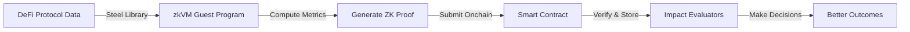

# 🔍 DeFi Evaluation Prover

> **Empowering Impact Evaluators with cryptographic proofs for smarter onchain decisions**

## 🎯 The Challenge

Impact Evaluators face a critical problem: how do you make informed decisions about DeFi protocols and their real-world impact without reliable, verifiable data? 

Traditional onchain metrics are often:
- 🚫 Unverifiable or easily manipulated
- 📊 Incomplete or lacking historical context
- 🔒 Expensive to compute and verify onchain
- ⏱️ Not real-time or sufficiently granular

**This is where zkVM comes in.** By generating zero-knowledge proofs for complex DeFi measurements, Impact Evaluators can finally access the trustless, accurate economic data they need to allocate resources effectively and measure true protocol impact.

## 💡 The Solution

This repository provides a suite of RISC Zero zkVM programs that generate cryptographic proofs for essential DeFi metrics. These proofs give Impact Evaluators verifiable, trustless data to inform their onchain decisions—no oracles, no trust assumptions, just math.

### What Can You Measure?

- **📈 Token Inflation**: Calculate exact inflation rates between any two blocks in basis points
- **💰 Compound APR**: Verify actual lending protocol yields with cryptographic certainty
- **🔄 Circulating Supply**: Track real circulating supply by excluding treasury/reserve addresses
- **🚀 And More**: Extensible framework for any DeFi metric Impact Evaluators need

## 🏃‍♂️ Quick Start

Get inflation data for any token in just 3 steps:

```bash
# 1. Create your .env file
cat > .env << 'EOF'
ETH_WALLET_ADDRESS=0xYourAddress
ETH_WALLET_PRIVATE_KEY=0xYourPrivateKey
ETH_RPC_URL=https://eth-mainnet.g.alchemy.com/v2/YOUR_KEY
TOKEN_ADDRESS=0xA0b86991c6218b36c1d19D4a2e9Eb0cE3606eB48  # USDC example
TOKEN_OWNER_2=0xReserveAddress  # Treasury/reserve to exclude
PAST_BLOCK_NUMBER=0x12345  # Historical block for comparison
EOF

# 2. Source the environment
source .env

# 3. Run the inflation calculator!
./e2e-test.sh
```

That's it! You'll get a verifiable proof of token inflation that can be used onchain. 🎉

## 📊 What Impact Evaluators Get

When you run the basic inflation example, you receive:

```solidity
struct ProofData {
    uint256 circulatingSupply;       // Current circulating supply
    uint256 pastCirculatingSupply;   // Historical circulating supply
    uint256 inflationBasisPoints;    // Inflation rate (100 = 1%)
    bytes32 commitment;               // Cryptographic commitment to the state
}
```

This data is:
- ✅ **Cryptographically verified** - Can't be faked or manipulated
- ✅ **Historical** - Compare any two points in time
- ✅ **Granular** - Basis point precision for accurate measurements
- ✅ **Efficient** - Cheap to verify onchain

## 🛠️ Environment Setup

### Required Variables

| Variable | Description | Example |
|----------|-------------|---------|
| `ETH_WALLET_ADDRESS` | Your wallet address | `0x123...abc` |
| `ETH_WALLET_PRIVATE_KEY` | Private key for transactions | `0xabc...123` |
| `ETH_RPC_URL` | Ethereum RPC endpoint | `https://eth-mainnet.g.alchemy.com/v2/KEY` |
| `TOKEN_ADDRESS` | ERC-20 token to analyze | `0xA0b86991c6218b36c1d19D4a2e9Eb0cE3606eB48` |
| `TOKEN_OWNER_2` | Treasury/reserve address to exclude | `0x456...def` |
| `PAST_BLOCK_NUMBER` | Historical block for comparison | `0x108b280` |

### Optional Variables

| Variable | Description | Default |
|----------|-------------|---------|
| `BONSAI_API_KEY` | For remote proving (faster) | Local proving |
| `BONSAI_API_URL` | Bonsai service endpoint | - |
| `HISTORY_BLOCKS` | Blocks to wait for finality | 0 |

## 🔬 Advanced Usage

### Running the Compound APR Analyzer

Track real yields from Compound protocol:

```bash
source .env
./e2e-compound.sh
```

This generates proofs of actual APR that Impact Evaluators can use to:
- Compare protocol efficiency
- Verify advertised yields
- Track lending market health

### Building Custom Metrics

Impact Evaluators often need specific metrics. Here's how to add your own:

1. Create a new guest program in `methods/guest/src/bin/`
2. Define your metric calculation using Steel
3. Generate proofs that Impact Evaluators can verify onchain

Example metrics to build:
- **TVL Changes**: Prove total value locked over time
- **User Activity**: Verify unique users or transaction counts
- **Protocol Revenue**: Calculate and prove fee generation
- **Liquidity Depth**: Prove available liquidity at different price points

## 🏗️ How It Works



1. **Data Collection**: Guest programs read blockchain state using Steel
2. **Computation**: Calculate metrics inside the zkVM (fully verifiable)
3. **Proof Generation**: RISC Zero creates a cryptographic proof
4. **Onchain Verification**: Smart contracts verify proofs with minimal gas
5. **Decision Making**: Impact Evaluators use verified data for decisions

## 👥 For Impact Evaluators

### Understanding the Proofs

Each proof contains:
- **Commitment**: Cryptographic proof of the exact blockchain state used
- **Metrics**: The calculated values (inflation, APR, etc.)
- **Verification**: Can be checked onchain by anyone

### Integration Examples

```solidity
// In your Impact Evaluator contract
function evaluateProtocol(bytes calldata proof) external {
    // Verify the proof
    ProofData memory data = verifier.verify(proof);
    
    // Use inflation data for decisions
    if (data.inflationBasisPoints < 200) { // Less than 2% inflation
        // This protocol maintains stable tokenomics
        allocateFunding(protocolAddress);
    }
}
```

### Use Cases

Impact Evaluators can use these proofs to:

- **🎯 Capital Allocation**: Direct funds to protocols with sustainable metrics
- **📈 Performance Tracking**: Monitor protocol health over time
- **⚖️ Fair Comparisons**: Compare protocols using verified, consistent data
- **🛡️ Risk Assessment**: Identify concerning trends before they become critical
- **🏆 Incentive Design**: Reward protocols based on verifiable impact

## 🚀 What's Next?

We're building more proofs that Impact Evaluators need:

- [ ] **Cross-protocol Metrics**: Compare multiple protocols in one proof
- [ ] **Composability Scores**: Measure protocol interconnectedness
- [ ] **MEV Impact**: Quantify value extraction affecting users
- [ ] **Decentralization Metrics**: Prove actual decentralization levels
- [ ] **Social Impact Scores**: Verify real-world impact claims

## 🤝 Contributing

Impact Evaluators know best what metrics they need. We welcome contributions for:

1. New metric calculations relevant to impact assessment
2. Integration examples with evaluation frameworks
3. Documentation for specific use cases
4. Performance optimizations for faster proof generation

## 📚 Resources

- [RISC Zero Documentation](https://dev.risczero.com)
- [Steel Library (Ethereum State Access)](https://github.com/risc0/risc0-ethereum/tree/main/steel)
- [Example Integration Contracts](./contracts/src/)

## 📄 License

Apache 2.0 - Built for the public good.

---

*Built with ❤️ for Impact Evaluators making DeFi better for everyone*